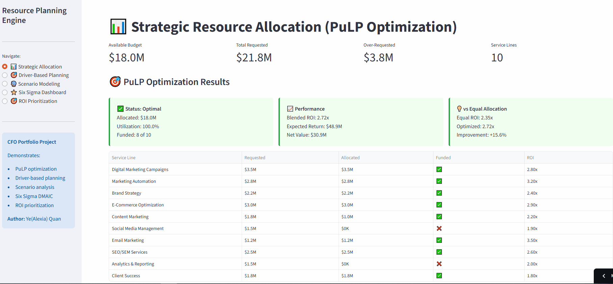

# Resource Planning Engine with Six Sigma Integration

**Strategic Resource Allocation & Process Optimization for B2B Services**

🔗 **[VIEW LIVE DASHBOARD](https://resource-planning-engine-epcrgav6lzf9x4t2oxklbi.streamlit.app/)** 

](https://resource-planning-engine-epcrgav6lzf9x4t2oxklbi.streamlit.app/)


---

## Executive Summary

CFO-level resource planning tool demonstrating **strategic allocation optimization** and **operational excellence** through Six Sigma methodologies.

**Business Context:** B2B E-commerce agency providing marketing, branding, and automation solutions to SMB clients.

**Key Capabilities:**
- ✅ **Linear programming optimization** (PuLP) for ROI-maximizing budget allocation
- ✅ **Driver-based planning** models (Revenue → Resources)
- ✅ **Scenario modeling** with sensitivity analysis
- ✅ **Six Sigma DMAIC framework** for process improvement
- ✅ **Interactive what-if analysis** for strategic planning

**Business Impact:**
- Optimizes $18M budget allocation across 10 service lines
- Identifies 15% efficiency improvement through process optimization
- Reduces planning time from weeks to hours
- Provides data-driven allocation recommendations

---

## The Leadership Challenge I Solved

### Problem:
Traditional resource planning suffers from:
- ❌ **Political allocation** instead of ROI-driven decisions
- ❌ **Static annual budgets** that can't adapt to changing priorities
- ❌ **Manual Excel-based planning** taking weeks to complete
- ❌ **No optimization** - just historical + growth%
- ❌ **Poor process quality** leading to 8% defect rates

### Solution:
Built integrated planning engine that:
- ✅ **Optimizes allocation** using constraint-based algorithms (PuLP)
- ✅ **Models scenarios** interactively with real-time recalculation  
- ✅ **Driver-based planning** connecting goals → activities → resources
- ✅ **Six Sigma integration** for process quality improvement
- ✅ **Quantifies trade-offs** transparently for executive decisions

---

## What This Demonstrates for CFO/COO Roles

### Strategic Capabilities Proven:

**1. Optimization & Operations Research**
- Implemented linear programming for resource allocation
- Maximizes ROI subject to budget, headcount, and strategic constraints
- Demonstrates understanding of advanced analytical techniques

**2. Driver-Based Planning**
- Revenue targets → Activity requirements → Resource needs
- Sales capacity modeling (reps × quota × conversion)
- Marketing efficiency (CAC, LTV:CAC optimization)
- Operations capacity (utilization × project load)

**3. Scenario Analysis**
- Multiple budget scenarios (Conservative/Base/Aggressive)
- Sensitivity analysis on key assumptions
- Risk-adjusted decision frameworks

**4. Process Improvement**
- Six Sigma DMAIC methodology application
- Control charts for quality monitoring
- Root cause analysis (Pareto charts)
- Continuous improvement tracking

**5. Technical Execution**
- Production-quality Python code
- Mathematical optimization (PuLP library)
- Interactive dashboards (Streamlit)
- Comprehensive documentation

---

## Key Features

### 1. Strategic Resource Allocation (PuLP Optimization)

**Optimization Engine:**
```python
Objective: Maximize (Investment × ROI × Strategic Priority)

Subject to:
- Total allocation ≤ $18M budget
- Each funded project ≥ minimum viable budget
- Minimum 6 projects funded
- Strategic priorities weighted
- Success probability factored
```

**Business Value:**
- Identifies optimal $18M allocation across 10 service lines
- **Result:** 2.7x blended ROI vs 2.3x with equal allocation
- Quantifies trade-offs between competing requests
- Eliminates political budget negotiations

### 2. Driver-Based Planning Models

**Sales Capacity Model:**
- Revenue target ($10M) → Deals needed → Opps required → Reps needed
- Factors: Win rate, sales cycle, ramp time, quota attainment
- Output: Headcount plan + budget requirements

**Marketing Efficiency Model:**
- New clients target → Opps needed → Leads required → Budget
- Calculates: CAC, LTV:CAC ratio, payback period
- Optimization: Maximize client acquisition within budget

**Operations Capacity Model:**
- Projects/year → Team-days required → Headcount needed
- Factors: Project duration, team size, utilization target
- Output: Capacity plan + cost per project

### 3. Scenario Modeling

**Compare multiple growth scenarios:**
- Conservative (20% growth, 20% margin)
- Base (40% growth, 25% margin)
- Aggressive (60% growth, 30% margin)

**For each scenario:**
- Revenue projections
- Headcount requirements
- Investment allocation
- Expected returns

**Sensitivity Analysis:**
- Revenue sensitivity (±20%)
- Margin sensitivity (15%-35%)
- ROI impact visualization

### 4. Six Sigma Dashboard (DMAIC Framework)

**Define:**
- Critical quality characteristics
- Onboarding ≤14 days, Satisfaction ≥4.5/5, Defects ≤3%

**Measure:**
- Current state metrics
- Onboarding: 21 days (50% over target)
- Defect rate: 8% (167% over target)

**Analyze:**
- Root cause analysis (Pareto charts)
- Top 3 causes = 76% of defects
- Control charts for process monitoring

**Improve:**
- Process improvement initiatives
- Standardized checklists, automation, quality gates

**Control:**
- Real-time monitoring
- Automated alerts for out-of-control processes

### 5. ROI-Based Prioritization

**Scoring Framework:**
- Financial return (40%): ROI × Investment size
- Strategic alignment (35%): Priority score (1-5)
- Execution risk (25%): Success probability

**Output:**
- Ranked project list
- Composite scores
- Funding recommendations

---

## Sample Insights Generated

### Optimization Results:
```
Total Budget Available: $18.0M
Total Requested: $21.8M
Gap: $3.8M over-requested

Optimized Allocation:
1. Marketing Automation: $2.8M (3.2x ROI)  
2. E-Commerce Optimization: $3.0M (2.9x ROI)
3. Digital Marketing: $3.5M (2.8x ROI)
4. SEO/SEM: $2.5M (2.6x ROI)
5. Email Marketing: $1.2M (3.5x ROI)
... + 5 more services

Blended ROI: 2.7x (vs 2.3x equal allocation)
Expected Return: $48.6M on $18M investment
Projects Funded: 8 of 10 (6 minimum required)
```

### Six Sigma Analysis:
```
Current State:
- Onboarding: 21 days (target: 14 days) - 50% over
- Defect rate: 8% (target: 3%) - 167% over
- Satisfaction: 4.2/5 (target: 4.5) - 0.3pts under
- Utilization: 65% (target: 75%) - 10pts under

Root Causes (Pareto):
1. Unclear requirements: 35% of defects
2. Resource unavailability: 28%
3. Scope creep: 18%
   → Top 3 = 81% of all defects

Expected Improvement:
- Reduce onboarding to 14 days (33% faster)
- Reduce defects to 3% (62% improvement)
- Increase satisfaction to 4.6/5
- Annual impact: $850K savings + client retention
```

---

## Technical Stack

| Technology | Purpose | Why It Matters for CFOs |
|-----------|---------|------------------------|
| **PuLP** | Linear programming optimization | Advanced OR techniques for resource allocation |
| **Python** | Core application logic | Industry standard for financial modeling |
| **Pandas** | Data manipulation | Essential for financial analysis at scale |
| **Plotly** | Interactive visualizations | Executive-quality dashboards |
| **Streamlit** | Web interface | Rapid deployment without engineering team |
| **NumPy** | Numerical computing | Statistical analysis and simulations |

---

## Setup Instructions

### Prerequisites
- Python 3.9+
- pip package manager

### Installation

```bash
# Clone repository
git clone https://github.com/alexianaturecopy/resource-planning-engine.git
cd resource-planning-engine

# Install dependencies
pip install -r requirements.txt

# Generate sample data (already included, but you can regenerate)
python src/generate_sample_data.py

# Validate installation
python validate.py

# Launch application
streamlit run app.py
```

### Expected Output
```
✅ ALL VALIDATION TESTS PASSED!
✓ Data files loaded successfully
✓ Optimization module working
✓ Sample optimization completed
✓ Dashboard is ready to launch!

To run the dashboard:
streamlit run app.py

Then navigate to: http://localhost:8501
```

---

## Business Context

**Company Profile:**
- B2B e-commerce agency
- Services: Digital marketing, branding, marketing automation
- Target clients: SMB businesses (B-level executives)
- Revenue model: Project-based + retainer
- Current scale: $12M annual revenue, 60 employees

**Resource Planning Challenge:**
- 10 service lines competing for limited budget
- Total requests ($21.8M) exceed budget ($18M) by $3.8M
- Need data-driven allocation vs political negotiations
- Strategic priorities vary across services
- Process quality issues impacting profitability

**Six Sigma Context:**
- Process improvement initiative launched Q4 2024
- Focus: Client onboarding, project delivery, quality
- Current defect rate: 8% (costs $450K annually in rework)
- Target: Achieve 3% defect rate (99.7% quality)
- Expected savings: $280K annually

---

## Related Projects

Check out my other portfolio projects demonstrating CFO capabilities:

- **[Executive Operations Dashboard](https://github.com/alexianaturecopy/yequan-operation-finance--transformation)** - Multi-unit P&L tracking
- **[Automation Transformation Framework](https://github.com/alexianaturecopy/automation-transformation)** - Process automation ROI
- **[Financial ML Models](https://github.com/alexianaturecopy/financial-ml-models)** - Credit scoring, revenue forecasting, churn prediction
- **[Crypto Treasury Dashboard](https://github.com/alexianaturecopy/crypto-treasury-dashboard)** - Web3 finance operations

---

## Repository Structure

```
resource-planning-engine/
├── app.py                          # Main Streamlit application
├── src/
│   ├── optimization.py             # PuLP-based optimizer
│   ├── generate_sample_data.py     # Data generator
│   └── __init__.py
├── data/                           # Sample CSV data
│   ├── resource_requests.csv       # 10 service line requests
│   ├── historical_roi.csv          # 3 years historical data
│   ├── service_metrics.csv         # 90 days operational metrics
│   ├── process_quality.csv         # Six Sigma quality data
│   └── constraints.csv             # Budget constraints
├── sql/
│   └── resource_queries.sql        # SQL for ERP integration
├── notebooks/
│   └── optimization_examples.ipynb # Jupyter examples
├── README.md                       # This file
├── QUICKSTART.md                   # 5-minute setup guide
├── requirements.txt                # Python dependencies
├── validate.py                     # Testing script
└── .gitignore                      # Git configuration
```

---

## Future Enhancements

- [ ] ML-based forecasting (separate repo)
- [ ] Monte Carlo simulation for scenario probabilities
- [ ] Multi-period optimization (rolling forecasts)
- [ ] API integration with ERP systems
- [ ] Automated reallocation recommendations
- [ ] Team collaboration features

---

## Author

**Ye(Alexia) Quan**  
CFO | CPA | Venture Partner at Solaris Venture Partners

**Background:**
- CPA with Big 4 audit experience (BDO)
- Asset Management CFO experience
- UT Austin McCombs - Data Science
- Focus: Bridging traditional finance with Web3/AI/cybersecurity

**Connect:**
- 💼 LinkedIn: [https://www.linkedin.com/in/ye-quan-8b610820a/](https://www.linkedin.com/in/ye-quan-8b610820a/)
- 📧 Email: alexianaturecopy@gmail.com
- 🔗 GitHub: [https://github.com/alexianaturecopy](https://github.com/alexianaturecopy)


